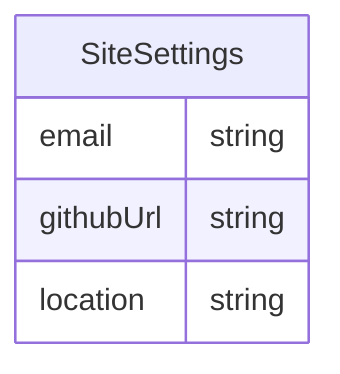
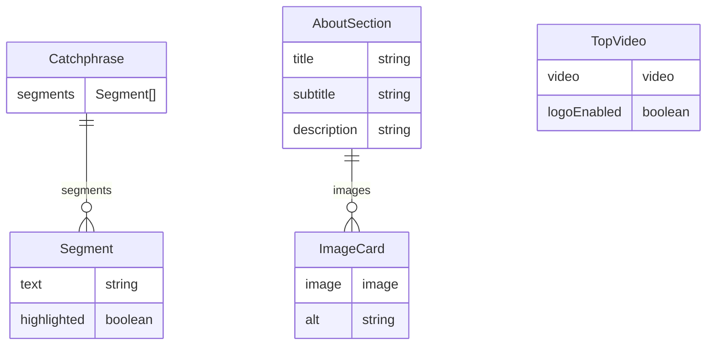
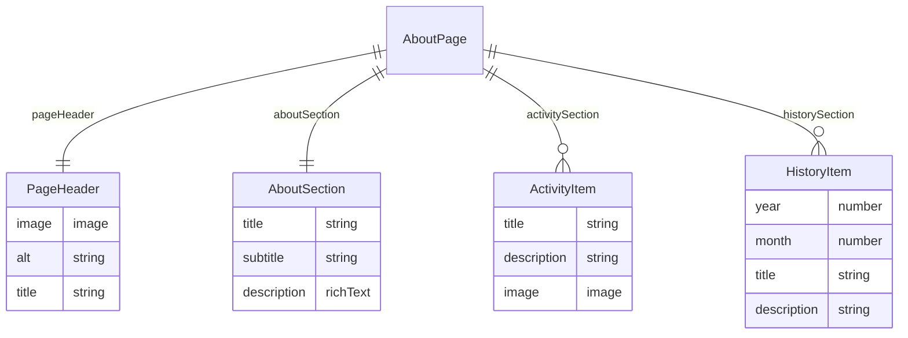
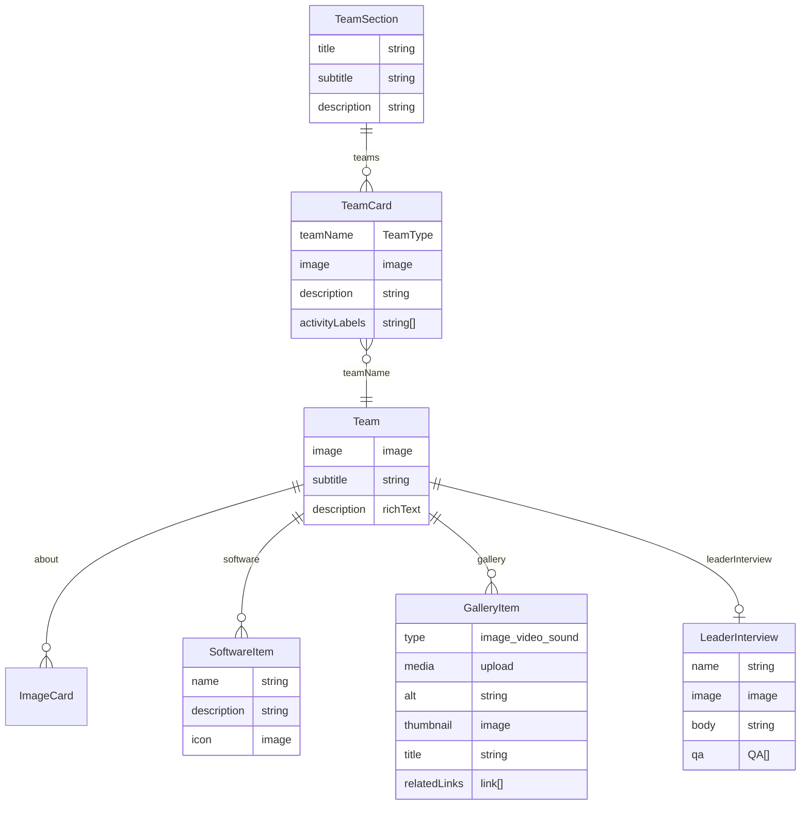
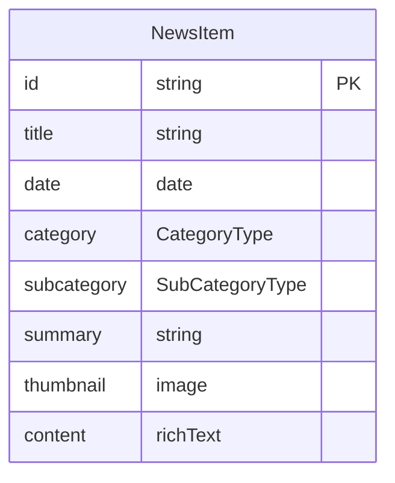
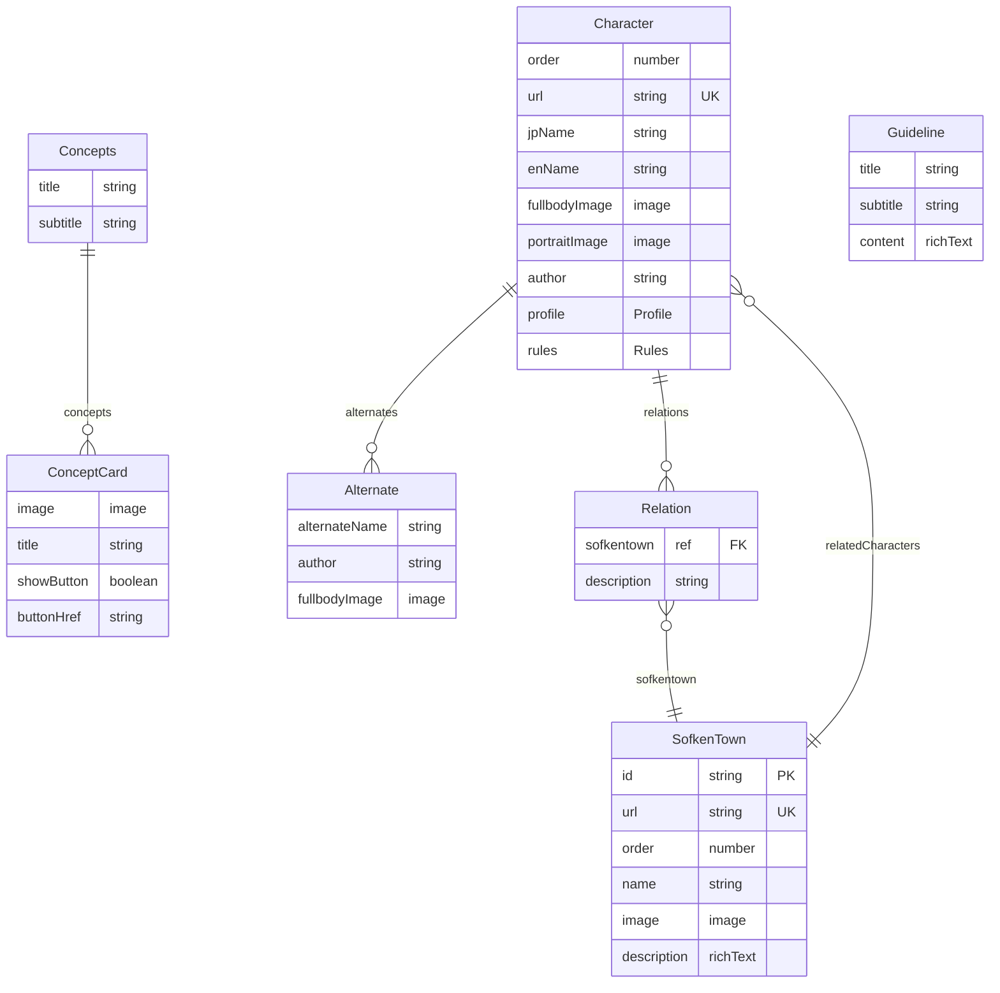
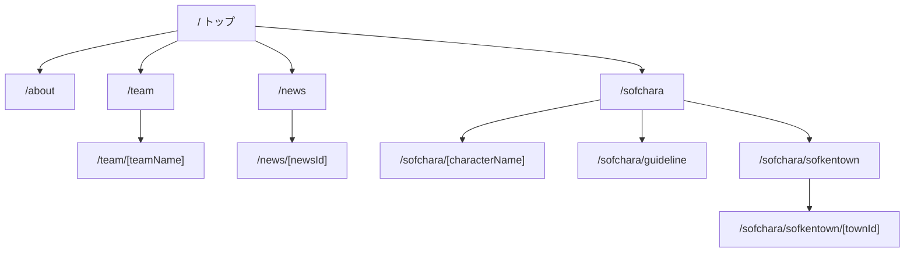

# コンテンツ管理スキーマ

このドキュメントは、TDU SRC Websiteで管理するコンテンツのスキーマ定義です。

## API全体図

以下の図はAPIドキュメントに基づくデータ構造を示しています。

### ER図（エンティティ関連図）

#### サイト設定・共通

#### トップページ

#### Aboutページ

#### Team

#### News

#### ソフキャラ

### ページ構成

## ドキュメント一覧

| ドキュメント | 対象 |
|-------------|------|
| [0-general-api.md](./0-general-api.md) | サイト設定・ソフケンタウン |
| [1-top-page-api.md](./1-top-page-api.md) | トップページ |
| [2-about-page-api.md](./2-about-page-api.md) | Aboutページ |
| [3-team-page-api.md](./3-team-page-api.md) | Teamページ・班詳細 |
| [4-news-page-api.md](./4-news-page-api.md) | Newsページ |
| [5-characters-page-api.md](./5-characters-page-api.md) | ソフキャラ・キャラクター・ガイドライン |
